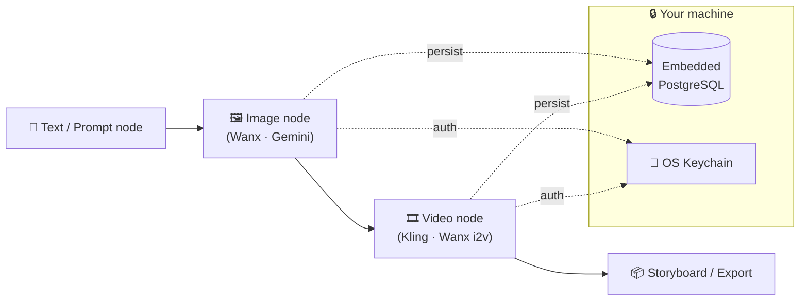

<div align="center">

# 🎬 InkFrame

**English** | **[中文](./README.zh-CN.md)**

**Local-first AI filmmaking workstation — wire text, image, and video AI into one node canvas, on your own machine.**

[](./LICENSE)
[]()
[](https://flutter.dev)
[](./ROADMAP.md)
[](https://github.com/KerroKapple/InkFrame/stargazers)

</div>

InkFrame is a desktop workstation for AI-driven filmmaking. A node-based canvas lets you chain
prompt → image → video through real providers — DashScope (Wanx), Kling, and Gemini — while every
project file and API key stays on **your disk**. No cloud account, no upload, no SaaS lock-in.

<!-- 📸 Maintainer: drop a canvas screenshot or short GIF here once UI Sprint 3 lands.
     A real visual is the single highest-leverage addition for star conversion. -->

## ✨ Why InkFrame

- **🔒 Local-first by design** — projects live in an embedded PostgreSQL on your machine; keys go to the OS Keychain / Credential Manager, never a plaintext `.env`.
- **🕸️ Node canvas** — compose shots visually: drop text / image / video nodes, wire them, and watch generation flow through the graph with live job progress.
- **🔌 Multi-provider** — mix and match image/video models from different vendors in one project. Adding a new one is a single file (see [`docs/PROVIDER-API.md`](docs/PROVIDER-API.md)).
- **🖥️ One codebase, two desktops** — macOS + Windows from a single Dart/Flutter source, frameless "Amber Noir" UI.
- **🧪 Quota-safe dev** — built-in fake providers run the whole app and exercise the canvas without burning a single API credit.

## 🔄 How it works



Build a shot graph on the canvas, hit generate, and InkFrame runs the jobs through your configured
providers — caching results and project state locally as it goes.

## 🎨 Providers

| Provider | Type | Status |
|----------|------|--------|
| Wanx (DashScope) | image · i2v · r2v · t2v | ✅ Implemented |
| Kling V3 / V3 Omni | video | ✅ Implemented |
| Gemini Image | image | ✅ Implemented |
| Stable Diffusion (local ComfyUI) | image | 🟢 Help wanted |
| OpenAI DALL·E 3 / GPT-Image | image | 🟢 Help wanted |
| Runway Gen-3 / Gen-4 | video | 🟢 Help wanted |
| Midjourney · Pika · Luma | image/video | 🟢 Help wanted |

Want to add one? It's the lowest-effort way to contribute — see [`docs/PROVIDER-API.md`](docs/PROVIDER-API.md) and the [Help Wanted](./ROADMAP.md#-help-wanted) list.

## 🚀 Get started

Requirements: Flutter ≥ 3.41, Dart ≥ 3.11, PostgreSQL 17 binaries on disk. macOS also needs Xcode 16 + CocoaPods.

```bash
git clone https://github.com/KerroKapple/InkFrame.git
cd InkFrame
flutter pub get

# Run with fake providers — no API keys, no quota burn
INKFRAME_PG_BIN=/opt/homebrew/opt/postgresql@17/bin \
INKFRAME_FAKE_PROVIDERS=1 \
flutter run -d macos
```

For real generation, drop `INKFRAME_FAKE_PROVIDERS` and add keys in **Settings → Providers**. Keys go to Keychain / Credential Manager.

```bash
flutter analyze              # 0 warnings (CI uses --fatal-infos)
flutter test                 # full suite
flutter test --tags integration
```

Environment variables, key storage, and data-directory layout: see [docs/ARCHITECTURE.md](docs/ARCHITECTURE.md).

## 🧱 Tech stack

Flutter (desktop) · Riverpod (state + DI) · Freezed (immutable models) · embedded PostgreSQL via `postgres` · `dio` (provider HTTP) · `flutter_secure_storage` (keys) · `media_kit` (video playback + frame extraction) · `window_manager` (frameless chrome).

## 📍 Status

**Alpha** (`v0.1.0-alpha.9`). Single Dart codebase shipping on macOS + Windows. Core canvas, generation
loop, secure key storage, and the first providers are in place; the road to beta is test coverage,
cross-platform smoke tests, and a performance baseline. See [ROADMAP.md](ROADMAP.md) for what's shipped and what's next.

## 📚 Documentation

- [ROADMAP.md](ROADMAP.md) — what's shipped, what's next
- [CONTRIBUTING.md](CONTRIBUTING.md) — workflow, hooks, commit rules
- [docs/ARCHITECTURE.md](docs/ARCHITECTURE.md) — DI, layers, error model, degradation
- [docs/PROVIDER-API.md](docs/PROVIDER-API.md) — adding a provider
- [docs/DATABASE.md](docs/DATABASE.md) — schema and migrations
- [docs/TESTING.md](docs/TESTING.md) — TDD layering and mocks
- [SECURITY.md](SECURITY.md) — reporting and key handling

## 🤝 Contributing

Maintainer-welcomed directions live in [ROADMAP.md](ROADMAP.md#-help-wanted) — providers, canvas UX,
i18n, and test infra. Please open an issue or post in [Discussions](https://github.com/KerroKapple/InkFrame/discussions)
to align scope **before** writing a large PR. First time? Look for the
[`good first issue`](https://github.com/KerroKapple/InkFrame/issues?q=is%3Aissue+is%3Aopen+label%3A%22good+first+issue%22) label.

## 🐞 Reporting bugs

Open a [GitHub issue](https://github.com/KerroKapple/InkFrame/issues) or start a [Discussion](https://github.com/KerroKapple/InkFrame/discussions).

## 📄 License

[MIT](./LICENSE)
