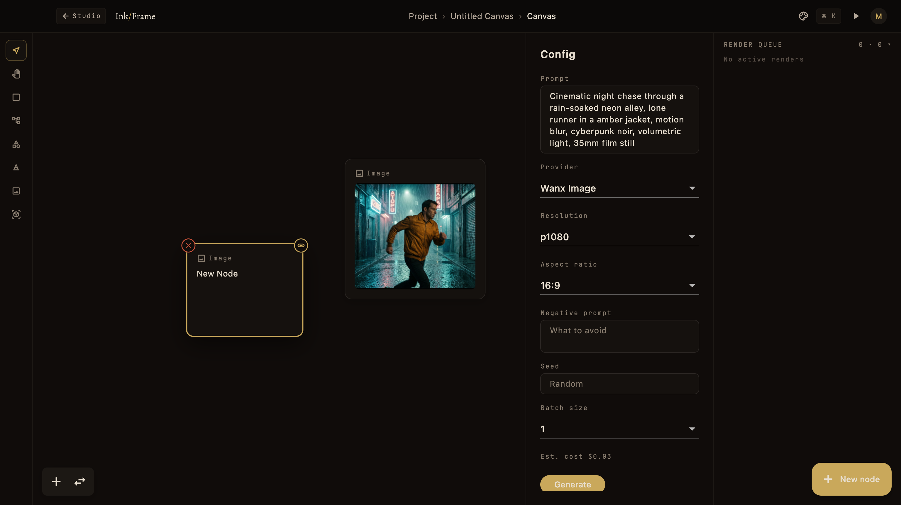
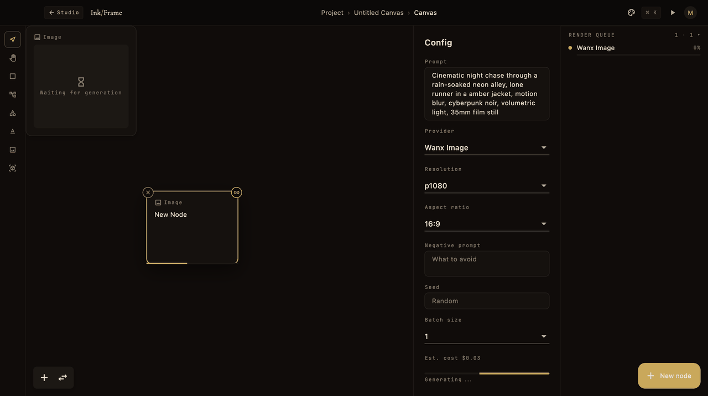
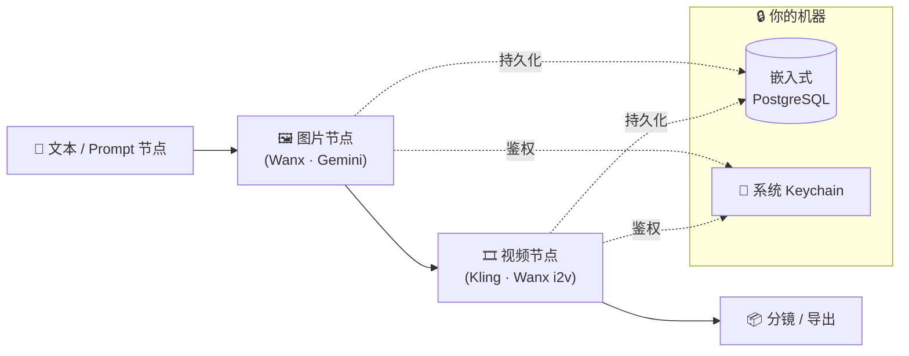

<div align="center">

# 🎬 InkFrame

**[English](./README.md)** | **中文**

**本地优先的 AI 影视创作工作站 —— 在你自己的机器上，用一张节点画布串起文本、图片、视频 AI。**

[](./LICENSE)
[]()
[](https://flutter.dev)
[](./ROADMAP.md)
[](https://github.com/KerroKapple/InkFrame/stargazers)

</div>

InkFrame 是一个面向 AI 影视创作的桌面工作站。节点画布让你把 prompt → 图片 → 视频串成一条链，
接到真实的 provider —— DashScope（Wanx）、Kling、Gemini 等 9 款内置 —— 而每一个工程文件和 API Key
都留在**你自己的磁盘**上。无需云账号，不上传，不绑定 SaaS。

<p align="center">
  
</p>

<p align="center">
  
</p>


## ✨ 为什么是 InkFrame

- **🔒 本地优先** —— 工程数据存在本机的嵌入式 PostgreSQL；Key 落到系统 Keychain / 凭据管理器，绝不是明文 `.env`。
- **🕸️ 节点画布** —— 可视化编排镜头：拖入文本 / 图片 / 视频节点，连线，看着生成沿着图流动并实时显示任务进度。
- **🔌 多 Provider** —— 在同一个工程里混搭不同厂商的图像/视频模型。新增一个 provider 只需写一个文件（见 [`docs/PROVIDER-API.md`](docs/PROVIDER-API.md)）。
- **🖥️ 一份代码，两个桌面** —— 单份 Dart/Flutter 源码同时跑 macOS + Windows，无边框 "Amber Noir" UI。
- **🧪 不烧配额的开发体验** —— 内置 fake provider，可在不消耗任何 API 配额的情况下跑完整应用、调试画布。

## 🔄 工作原理



在画布上搭好镜头图，点击生成，InkFrame 会把任务跑到你配置好的 provider 上 ——
过程中把结果与工程状态都缓存在本地。

## 🎨 Provider

| Provider | 类型 | 状态 |
|----------|------|------|
| Wanx (DashScope) | image · i2v · r2v · t2v | ✅ 已实现 |
| Kling V3 / V3 Omni | video | ✅ 已实现 |
| Gemini Image | image | ✅ 已实现 |
| OpenAI GPT-Image（`gpt-image-2`） | image | ✅ 已实现 |
| Stability Stable Image Core | image | ✅ 已实现 |
| OpenAI 兼容自定义端点（`custom_providers.json`） | image | ✅ 已实现 |
| Stable Diffusion (本地 ComfyUI) | image | 🟢 Help wanted |
| OpenAI DALL·E 3（专用接入） | image | 🟢 Help wanted |
| Runway Gen-3 / Gen-4 | video | 🟢 Help wanted |
| Midjourney · Pika · Luma | image/video | 🟢 Help wanted |

想加一个？这是门槛最低的贡献方式 —— 见 [`docs/PROVIDER-API.md`](docs/PROVIDER-API.md) 和 [Help Wanted](./ROADMAP.md#-help-wanted) 列表。

## 🚀 上手

依赖：Flutter ≥ 3.41、Dart ≥ 3.11、本地 PostgreSQL 17 二进制。macOS 还需要 Xcode 16 + CocoaPods。

```bash
git clone https://github.com/KerroKapple/InkFrame.git
cd InkFrame
flutter pub get

# 用 fake provider 跑，不烧 API 配额
INKFRAME_PG_BIN=/opt/homebrew/opt/postgresql@17/bin \
INKFRAME_FAKE_PROVIDERS=1 \
flutter run -d macos
```

接真实 API 时去掉 `INKFRAME_FAKE_PROVIDERS`，进 **Settings → Providers** 填 Key。Key 落到 Keychain / 凭据管理器。

```bash
flutter analyze              # 0 warning（CI 用 --fatal-infos）
flutter test                 # 全量
flutter test --tags pg       # 真 PG 集成测试（需 TEST_PG_URL，未设自动跳过）
```

环境变量、密钥后端、数据目录布局见 [docs/ARCHITECTURE.md](docs/ARCHITECTURE.md)。

## 🧱 技术栈

Flutter（桌面）· Riverpod（状态 + DI）· Freezed（不可变模型）· 嵌入式 PostgreSQL（`postgres`）· `dio`（provider HTTP）· `flutter_secure_storage`（密钥）· `media_kit`（视频播放 + 首帧抽帧）· `window_manager`（无边框窗口）。

## 📍 状态

**Alpha**（`v0.1.0-alpha.9`）。单份 Dart 代码同时发布 macOS + Windows。M1「能用起来」与
M2「创作者要的」（角色一致性 / 批量变体 / 预设库 / 成本估算）已完成、CI 全绿；M3 四方向
首切片进行中（分镜 / 自定义 Provider / 画廊 / 视频导出）。剩余 beta 缺口见
[docs/BOARD.md](docs/BOARD.md)；已发布与待办见 [ROADMAP.md](ROADMAP.md)。

## 📚 文档

- [ROADMAP.md](ROADMAP.md) — 已发布与待办
- [CONTRIBUTING.md](CONTRIBUTING.md) — 流程、hook、commit 规范
- [docs/ARCHITECTURE.md](docs/ARCHITECTURE.md) — DI、分层、错误模型、降级
- [docs/PROVIDER-API.md](docs/PROVIDER-API.md) — 接入新 Provider
- [docs/DATABASE.md](docs/DATABASE.md) — schema 与迁移
- [docs/TESTING.md](docs/TESTING.md) — TDD 分层与 mock
- [SECURITY.md](SECURITY.md) — 漏洞报告与密钥处理

## 🤝 参与贡献

维护者欢迎的方向见 [ROADMAP.md](ROADMAP.md#-help-wanted) —— provider、画布 UX、i18n、测试基建。
动手写大 PR **之前**，请先开 issue 或在 [Discussions](https://github.com/KerroKapple/InkFrame/discussions)
对齐 scope。第一次贡献？找
[`good first issue`](https://github.com/KerroKapple/InkFrame/issues?q=is%3Aissue+is%3Aopen+label%3A%22good+first+issue%22) 标签。

## 🐞 Bug 反馈

提 [GitHub issue](https://github.com/KerroKapple/InkFrame/issues) 或开 [Discussion](https://github.com/KerroKapple/InkFrame/discussions)。

## 📄 License

[MIT](./LICENSE)
