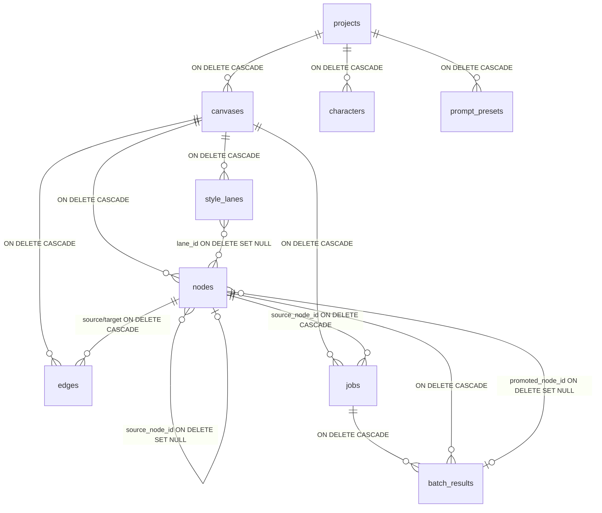

# InkFrame Database Reference

> 目标：一处阅读就能还原 DB 全景。PRD §21 / §21.9 / §22.0 / §22.1 / §4.5.1 / §4.6.1 的运维视角映射。

## Schema 版本管理

- 当前版本 `schema_version.version = 7`
- 真相源：`lib/storage/schema/schema_v1.dart` … `schema_v7.dart`（v4 删死列 next_poll_at；v5 复合索引 idx_jobs_canvas_created；v6 characters 表；v7 prompt_presets 表）
- 文档镜像：`lib/storage/schema/001_init.sql` / `002_*.sql` / `003_*.sql` / `004_drop_next_poll.sql` / `005_jobs_canvas_created_idx.sql`（不被运行时加载）；**v6 起真相源仅 .dart，不再落 .sql 镜像**
- `MigrationRunner`（`lib/storage/migrations/migration_runner.dart`）由 `database.dart` 组装迁移列表
- 数据库版本 > 应用期望 → 抛 `SchemaMigrationError`，提示升级应用
- 数据库版本 < 应用期望 → 按序执行；每条迁移的 DDL 与 `schema_version` UPSERT 在 **同一事务**（runTx）内，失败整体回滚，版本号统一由 runner 写（迁移 SQL 不自写）

`CREATE EXTENSION IF NOT EXISTS pgcrypto` 在 `pgMigratedPoolProvider` 里独立执行，DDL 本身不含扩展语句——并发情形下减少 `23505 duplicate_object` 冲突。

连接层为 `Pool`（`pgPoolProvider`，上限 4 连接）：连接懒建、断线后下一次执行自动换新连接；仓储层持 `Pool`（实现 `Session`）。

## 表关系图



## ON DELETE 策略矩阵

| 父表 | 子表 | 列 | 策略 | 备注 |
|------|------|----|------|------|
| projects | canvases | project_id | CASCADE | 项目删除级联删画布 |
| canvases | nodes | canvas_id | CASCADE |  |
| canvases | edges | canvas_id | CASCADE |  |
| canvases | style_lanes | canvas_id | CASCADE |  |
| canvases | jobs | canvas_id | CASCADE |  |
| nodes | edges | source_node_id | CASCADE | 节点级连线双向清 |
| nodes | edges | target_node_id | CASCADE |  |
| nodes | nodes | source_node_id | SET NULL | §4.5.1 孤儿 result 节点 |
| style_lanes | nodes | lane_id | SET NULL |  |
| nodes | jobs | source_node_id | CASCADE |  |
| nodes | jobs | result_node_id | SET NULL | v=2 修（原 v=1 为 NO ACTION，见 schema_v2.dart） |
| nodes | projects | cover_node_id | SET NULL | v=3 补 FK（原悬空无约束，见 schema_v3.dart） |
| jobs | batch_results | job_id | CASCADE |  |
| nodes | batch_results | node_id | CASCADE |  |
| nodes | batch_results | promoted_node_id | SET NULL |  |
| projects | characters | project_id | CASCADE | v=6（项目级角色，schema_v6.dart） |
| projects | prompt_presets | project_id | CASCADE | v=7（项目级预设库，schema_v7.dart） |

## CHECK 约束清单

### 枚举白名单

| 表 | 列 | 允许值 |
|----|----|--------|
| nodes | type | image / video / text / shot（shot 为 P1 预留） |
| nodes | node_role | config / result |
| nodes | status | idle / uploading / generating / success / error / cancelled |
| edges | edge_type | data / narrative / generation_source |
| edges | role | reference / first_frame / last_frame |
| jobs | job_type | image / video |
| jobs | status | pending / submitted / polling / success / error / cancelled / timeout |
| batch_results | status | generating / success / error / cancelled |
| canvases | lane_direction | horizontal / vertical |
| schema_version | id | `CHECK (id = 1)` — 单行约束 |

### 字段长度约束（PRD §21.9）

| 表.字段 | DB 上限 | 应用层上限 |
|---------|---------|-----------|
| projects.name | 200 | 同 |
| canvases.name | 200 | 同 |
| canvases.base_style_prefix | 4096 | 同 |
| canvases.base_style_suffix | 4096 | 同 |
| style_lanes.label | 100 | 同 |
| style_lanes.style_prompt | 4096 | 同 |
| nodes.label | 200 | 同 |
| characters.name | 200 | 同（v=6，chk_characters_name） |
| characters.description | 4096 | 同（v=6，chk_characters_desc） |
| prompt_presets.name | 200 | 同（v=7，chk_prompt_presets_name） |
| prompt_presets.prompt | 4096 | 同（v=7，chk_prompt_presets_prompt） |
| jobs.full_prompt | 131072 | 128KB 硬截断 |
| nodes.type_config.prompt | — | 32KB |
| nodes.type_config.negative_prompt | — | 8KB |
| nodes.type_config.text (type=text) | — | 64KB |
| jobs.error_message | — | 2KB |

JSONB 内字段长度不落 DB CHECK（路径查询开销大），由 freezed + assert 保障。

### 其他

| 约束 | 含义 |
|------|------|
| jobs.progress CHECK BETWEEN 0.0 AND 1.0 | 进度必须在 [0,1] |
| nodes chk_grid_consistency | `parent_grid_id IS NOT NULL` 蕴含 `is_grid_generation=false` 且 `grid_children=[]`（PRD §4.6.1） |
| edges 部分唯一索引 uq_edges_live (source_node_id, target_node_id, edge_type) WHERE deleted_at IS NULL | 同向同类型 **活** 连线唯一；软删行不占槽位（v=3，原 v=1 为表级 UNIQUE） |
| batch_results UNIQUE(node_id, slot_index) | 同 batch 节点内 slot 不重复 |

## nodes.type_config 元数据键（JSONB）

> `nodes.type_config` 为无 schema JSONB，键由应用层约定。下表登记生成产物与视频元数据键；
> 长度受约束的文本键见上「字段长度约束」表。产物相对路径均为 canvas 相对（PRD §12.6）。

| 键 | 类型 | 写入方 | 含义 |
|----|------|--------|------|
| image_url | string | JobMediaPersister | 图片产物相对路径（`images/...`） |
| video_url | string | JobMediaPersister | 视频产物相对路径（`videos/...`） |
| thumbnail_url | string | JobMediaPersister | 视频首帧缩略图相对路径（`videos/*.jpg`） |
| duration_ms | int | JobMediaPersister（XM-1） | 视频时长（毫秒）；探针值 **非空且 >0** 才写，否则缺省 |
| width | int | JobMediaPersister（XM-1） | 视频像素宽；探针值 **非空且 >0** 才写，否则缺省 |
| height | int | JobMediaPersister（XM-1） | 视频像素高；探针值 **非空且 >0** 才写，否则缺省 |

> XM-1：视频 `duration_ms` / `width` / `height` 由 `_persistRemoteUrls` 视频分支在写 `thumbnail_url`
> 同块落库——媒体来源 `ThumbnailService.extractFirstFrame` 返回的 `VideoProbeResult`
> （media_kit 顺读 `player.state`）。探针不可得（0/null）→ 不写该键（无垃圾键），读侧缺省为 null。

## 索引

| 索引 | 表 | 列 | 类型 |
|------|----|-----|------|
| idx_canvases_project_id | canvases | project_id | 常规 |
| idx_canvases_deleted | canvases | deleted_at | 部分（WHERE deleted_at IS NOT NULL） |
| idx_style_lanes_canvas_id | style_lanes | canvas_id | 常规 |
| idx_style_lanes_deleted | style_lanes | deleted_at | 部分 |
| idx_nodes_canvas_id | nodes | canvas_id | 常规 |
| idx_nodes_source | nodes | source_node_id | 常规 |
| idx_nodes_lane | nodes | lane_id | 常规 |
| idx_nodes_deleted | nodes | deleted_at | 部分 |
| idx_edges_canvas_id / source / target / deleted | edges | canvas_id / source_node_id / target_node_id / deleted_at | 常规 / 常规 / 常规 / 部分 |
| idx_jobs_status | jobs | status | 常规 |
| idx_jobs_canvas_id | jobs | canvas_id | 常规 |
| idx_jobs_canvas_created | jobs | (canvas_id, created_at DESC) | 复合（v=5，listByCanvas 过滤+排序同索引） |
| idx_jobs_completed | jobs | completed_at | 部分（WHERE completed_at IS NOT NULL） |
| idx_batch_results_node_id / job_id | batch_results | node_id / job_id | 常规 |
| idx_projects_deleted | projects | deleted_at | 部分 |
| idx_characters_project_id | characters | project_id | 常规（v=6） |
| idx_characters_deleted | characters | deleted_at | 部分（v=6） |
| idx_prompt_presets_project_id | prompt_presets | project_id | 常规（v=7） |
| idx_prompt_presets_deleted | prompt_presets | deleted_at | 部分（v=7） |

## updated_at 维护

PRD §21 硬规则：**应用层维护，禁止 DB trigger**。

- `BaseRepository.withUpdatedAt(patch)` 统一注入时间戳
- `BaseRepository.buildUpdate(table, id, patch)` 自动拼 `updated_at = @p_updated_at`
- 质量闸门 `test/quality/updated_at_test.dart`（pre-commit 阻断式跑，取代已删的 check-updated-at.sh）扫描 `lib/storage/`，`UPDATE <table> SET` 若缺少 `updated_at` 即红
- 白名单：`edges` / `jobs` / `batch_results` / `schema_version` 表无 `updated_at` 列，天然豁免

## Retention 策略（PRD §21）

Jobs 表的 30 天保留 + 单 canvas 500 条上限（常量：`lib/core/constants/job_housekeeping.dart`）：

- `JobQueueService.init()` 在启动 orphan 回收后接线执行；purge 失败不阻断启动
- 只清终态行（success/error/cancelled/timeout）——在途 job 绝不被删
- 排除"孤儿 result 节点依赖"的 job（§4.5.1 要求 jobs 是真相源）
- 实现：`PostgresJobRepository.purgeExpired` + `purgePerCanvasCap`

## batch_results 生命周期（表侧注记）

> 语义正本是 ARCHITECTURE.md §5.1「批量 slot 收敛」；本节只记表侧事实。

- 行由**提交事务预建**（batch_size>1 时与 result 节点 / jobs 行同事务，status=`generating`
  占位），此后 JobQueue 逐 slot 收敛到终态（`success` / `error` / `cancelled`，见 status CHECK）
- **slot 只从 `generating` 单向收敛**：收敛写全部是「条件批量 UPDATE，只圈 `status='generating'`
  行」——终态行绝不被改写（取消/失败保留已 success slot 的部分成功语义靠这一点成立）
- `BatchResultRepository` 三个非 CRUD 方法（`lib/core/interfaces/batch_result_repository.dart`，
  实现 `postgres_batch_result_repository.dart`）：
  - `listSuccessByProject(projectId)` — 本仓**唯一跨表 JOIN 读**：`batch_results JOIN nodes
    JOIN canvases`，两层 `deleted_at IS NULL` 过滤（节点/画布任一软删即不见），画廊消费
  - `finalizePendingByJob(jobId, toStatus, errorCode)` — 单 job 终态收敛（JobQueue 终态链）
  - `finalizeAllPending(toStatus, errorCode)` — 全表孤儿收敛（启动期 `JobQueueService.init()`）
  - 后两者是本仓**唯二的条件批量收敛写**

## Migration 命名规范

```
lib/storage/schema/001_init.sql                              # v=1 文档镜像（运行时不加载）
lib/storage/schema/002_jobs_result_node_id_set_null.sql      # v=2 增量镜像
lib/storage/schema/003_edges_unique_cover_fk_retry_drop.sql  # v=3 增量镜像
lib/storage/schema/004_drop_next_poll.sql                    # v=4 增量镜像
lib/storage/schema/005_jobs_canvas_created_idx.sql           # v=5 增量镜像（最后一个 .sql 镜像）
```

文件名格式：`<三位版本号>_<短描述>.sql`，版本号必须单调递增无缺口。
**v6 起不再落 .sql 镜像**——真相源仅 `schema_vN.dart`（v6 characters / v7 prompt_presets），
新迁移走 `schema_vN.dart` + `kAppMigrations` 追加一行。

## 嵌入式 PG 运维（PRD §22.1）

- 版本锁：`scripts/pg/pg-version.txt` = 17.2
- 启动目录：`<数据根>/database/`（PGDATA；数据根=Win `%LOCALAPPDATA%\InkFrame`、macOS
  `~/Library/Application Support/InkFrame`，DIR-1；存量 `~/InkFrame` 启动时一次性搬迁）
- 端口：`ServerSocket.bind(0)` 派随机端口，写入 `<数据根>/config/pg.port`
- 崩溃恢复：`postmaster.pid` 存在但进程死 → 删 pid 文件后重启
- 强制绑定 `127.0.0.1`，`unix_socket_directories=` 空（规避 socket 目录权限）
- 数据目录搬迁：见 PRD §12.6 八步流程（暂停 → stop → 原子 rename → 重启）
- 每日冷备（LB-10）：启动 post-frame 触发 `pg_dump -Fc` 落 `<数据根>/backups/inkframe-YYYY-MM-DD.dump`，
  当日已有则跳过、保留最新 7 份；PGPASSWORD 经 env 传 SCRAM 口令；任何失败仅 warn 不阻断。
  恢复手册见 [SETUP.md](SETUP.md)「数据库备份与恢复」（app 内一键还原=LB-22）

## 技术债

见 `docs/internal/tech-debt.md`。当前无未决项（TD-001 已在 schema v=2 修复）。
